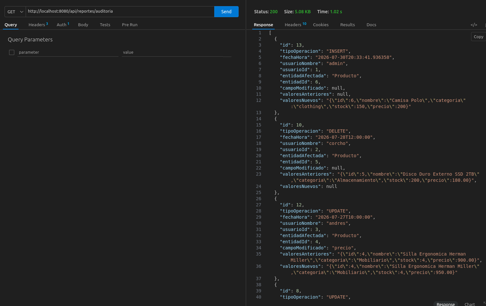
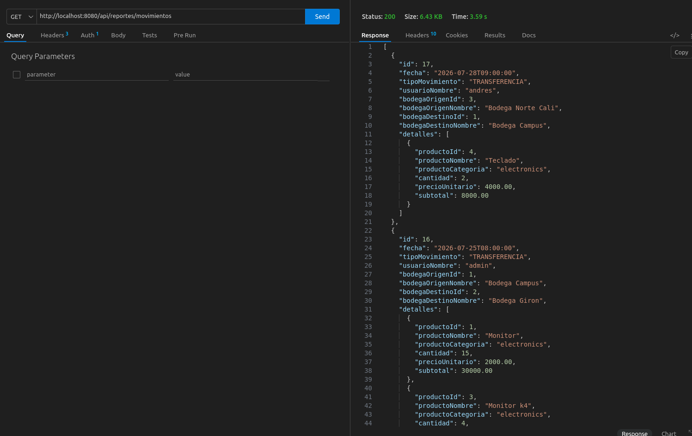
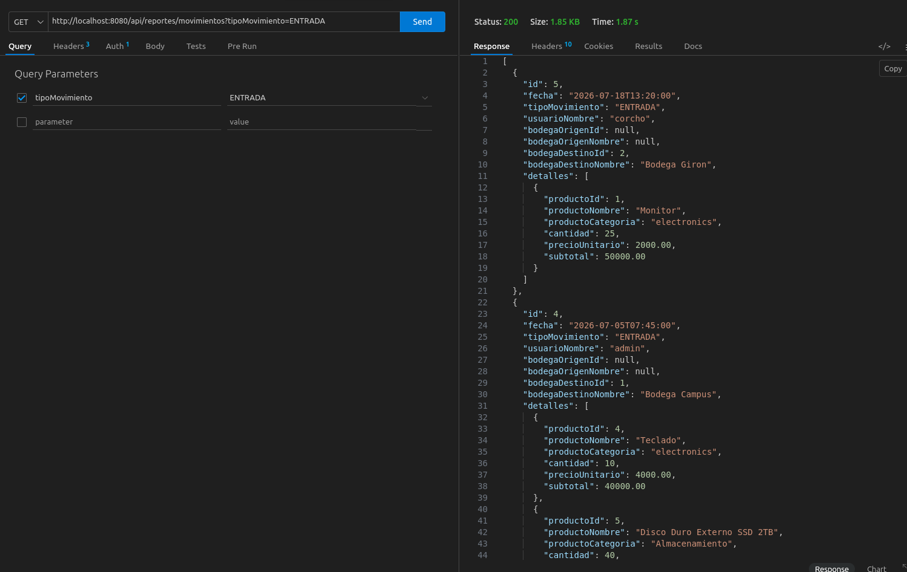
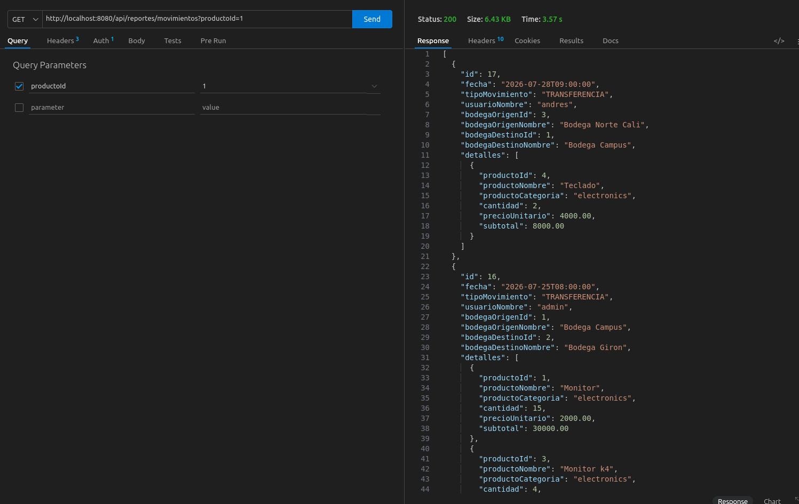
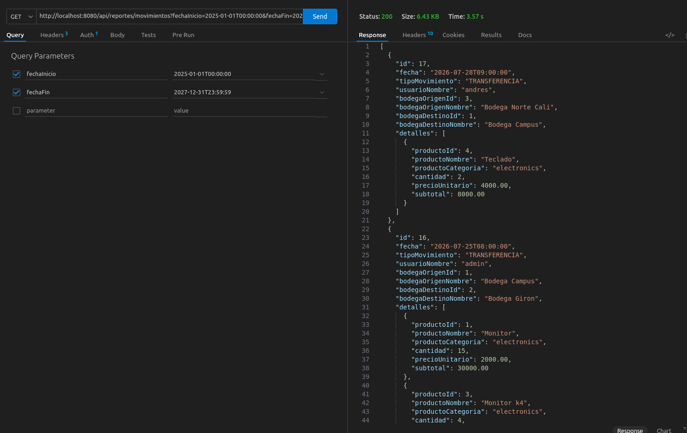
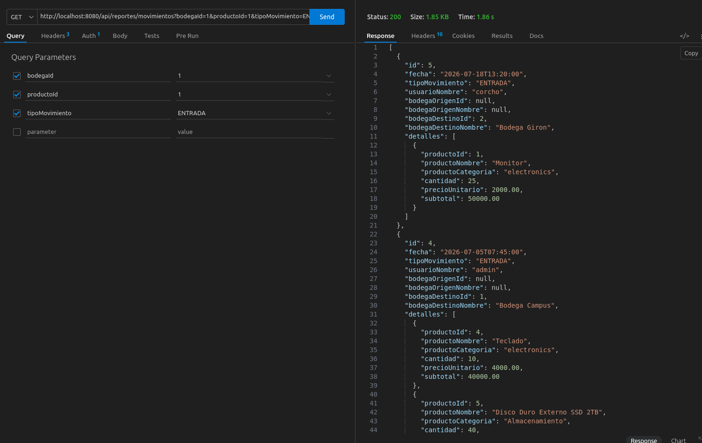
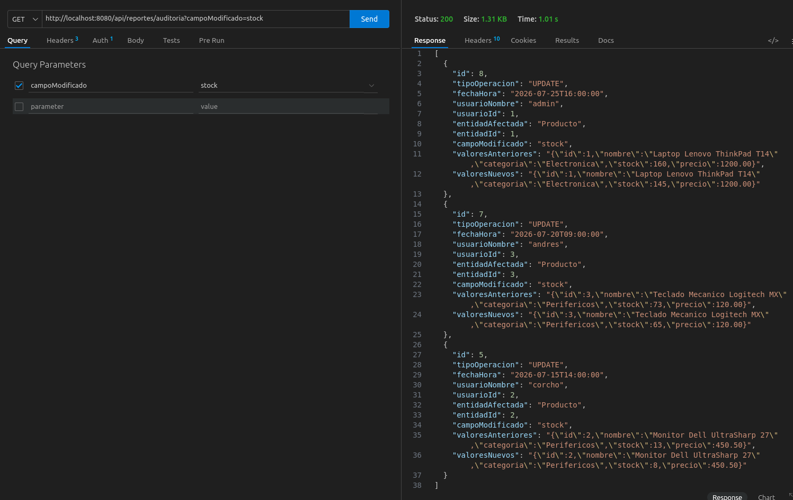

# Módulo de Reportes - Examen LogiTrack

## Descripción

Módulo especializado para la generación y consulta de reportes del sistema de gestión de inventarios LogiTrack. Permite filtrar y visualizar movimientos de inventario y registros de auditoría a través de una API REST con múltiples criterios de búsqueda.

## Endpoints

### Reportes de Movimientos de Inventario

| Método | Ruta | Descripción | Parámetros |
|--------|------|-------------|------------|
| `GET` | `/api/reportes/movimientos` | Obtiene movimientos de inventario filtrados con múltiples criterios | `bodega` (opcional), `producto` (opcional), `tipoMovimiento` (opcional: ENTRADA, SALIDA, AJUSTE), `fechaInicio` (opcional), `fechaFin` (opcional) |

### Reportes de Auditoría

| Método | Ruta | Descripción | Parámetros |
|--------|------|-------------|------------|
| `GET` | `/api/reportes/auditoria` | Obtiene registros de auditoría filtrados con múltiples criterios | `producto` (opcional), `fechaInicio` (opcional), `fechaFin` (opcional), `campoModificado` (opcional) |

## Arquitectura Técnica

El módulo sigue una arquitectura en capas:

```
Controller (ReporteExamenController)
    ↓
Service (ReporteExamenService)
    ↓
Specifications (MovimientoInventarioSpecification / AuditoriaSpecification)
    ↓
Repository (MovimientoInventarioRepository / AuditoriaRepository)
```

### Capas

- **Controller**: Define los endpoints REST en `/api/reportes/` con validación de parámetros opcionales.
- **Service**: Contiene la lógica de negocio y transformación de entidades a DTOs.
- **Specifications**: Implementa el patrón JPA Criteria API para consultas dinámicas, evitando errores de PostgreSQL relacionados con tipos de datos en parámetros NULL.
- **Repository**: Acceso a datos con Spring Data JPA.

## DTOs (Data Transfer Objects)

### MovimientoReporteDTO
- `id`, `fecha`, `tipoMovimiento`, `usuarioNombre`
- `bodegaOrigenId`, `bodegaOrigenNombre`
- `bodegaDestinoId`, `bodegaDestinoNombre`
- `detalles`: Lista de `DetalleReporteDTO` con información de productos (id, nombre, categoría, cantidad, precio unitario, subtotal)

### AuditoriaReporteDTO
- `id`, `tipoOperacion`, `fechaHora`
- `usuarioNombre`, `usuarioId`
- `entidadAfectada`, `entidadId`
- `campoModificado`, `valoresAnteriores`, `valoresNuevos`

## Tecnologías Utilizadas

- **Java 17+** con Spring Boot
- **Spring Data JPA** con Criteria API (Specifications)
- **Lombok** para reducción de código boilerplate
- **PostgreSQL** como base de datos

## EVIDENCIAS















